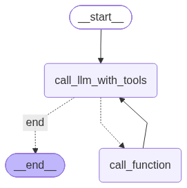

# Personal assistant

## Граф агента


## Установка зависимостей
```bash
uv sync
```

## Запуск REST сервера с агентом
```bash
uv run -m uvicorn app:app --reload
```

## Запуск UI для работы с агентом
```bash
uv run -m gradio chat.py
```