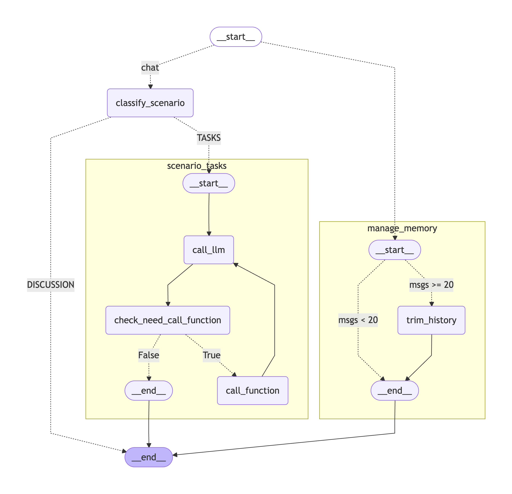
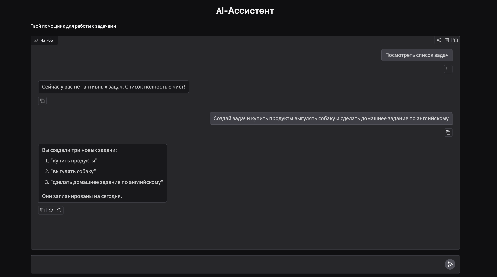

# Personal assistant

Агент-ассистент для управления персональными задачами через естественный язык.  
Понимает запросы пользователя, классифицирует их на **обсуждение** и **выполнение задач**, вызывает нужные инструменты и ведёт историю диалога.

## Возможности

- Создание новых задач
- Просмотр списка активных задач
- Завершение задач
- Отмена задач
- Удаление задач
- Получение текущей даты и времени
- Ведение диалога с управлением историей сообщений
- Автоматическая классификация сценария: `DISCUSSION` или `TASKS`
- Вызов инструментов (tools) по необходимости

## Инструменты (Tools)

| Инструмент | Назначение | Основные параметры |
|---|---|---|
| `create_task` | Создаёт новую задачу | `title`, `description`, `due_date`, `priority` |
| `get_todo_task_list` | Возвращает список незавершённых задач | — |
| `complete_task` | Отмечает задачу как выполненную | `task_id` |
| `cancel_task` | Отменяет задачу | `task_id` |
| `delete_task` | Удаляет задачу | `task_id` |
| `get_current_datetime` | Возвращает текущую дату и время | — |

## Как это работает

1. Пользователь отправляет сообщение.
2. Агент классифицирует запрос:
   - `DISCUSSION` — обычный диалог, ответ без вызова задач.
   - `TASKS` — сценарий работы с задачами.
3. В режиме `TASKS` запускается подграф `scenario_tasks`:
   - LLM формирует ответ или решение о вызове функции.
   - Проверяется необходимость вызова инструмента.
   - При необходимости вызывается нужный tool.
   - Результат возвращается в LLM для финального ответа.
4. Параллельно подграф `manage_memory` управляет историей:
   - если сообщений меньше 20 — история не обрезается;
   - если сообщений 20 и больше — выполняется `trim_history`.
5. Пользователь получает ответ.

## Примеры запросов

| Запрос пользователя | Действие агента |
|---|---|
| «Напомни завтра в 18:00 позвонить врачу» | `create_task` |
| «Что у меня по задачам?» | `get_todo_task_list` |
| «Отметь задачу 42 выполненной» | `complete_task` |
| «Отмени задачу 17» | `cancel_task` |
| «Удали задачу 5» | `delete_task` |
| «Какое сегодня число?» | `get_current_datetime` |
| «Как дела?» | `DISCUSSION`, ответ без вызова tools |

## Граф агента


## UI чат бота


## Установка зависимостей
```bash
uv sync
```

## Запуск REST сервера с агентом
```bash
uv run -m uvicorn app:app --reload
```

## Запуск UI для работы с агентом
```bash
uv run -m gradio chat.py
```


